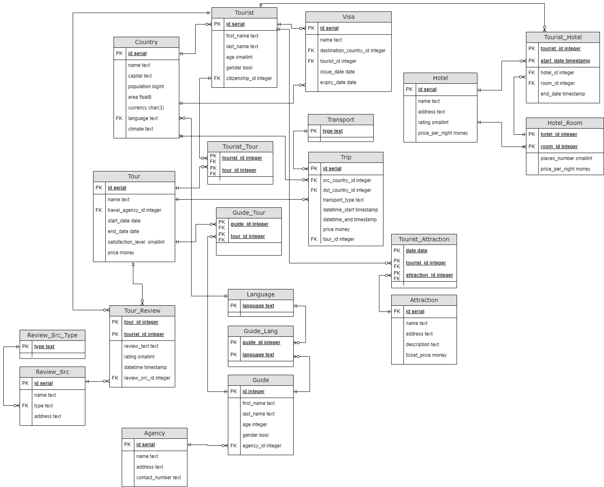

# Описание проекта

Веб-сервис, предоставляющий возможность организовать тур в другой город/страну. 
Клиент может бронировать номер в отеле в определенные даты; оформлять билеты на транспорт и подбирать маршрут и тип транспорта из доступных; просматривать достопримечательности в каждой локации.

## Текущая даталогическая модель

## Планируемые изменения и улучшения
- Добавить автоматическую генерацию всех недостающих таблиц БД;
- Провести рефакторинг кода, сделав более читаемым и более соответствующим best practices языка Go;
- Добавить больше тестов для сервиса в целом и БД в частности;
- Проанализоровать и улучшить производительность работы БД;
- Исправить/улучшить модуль аутентификации. Вместо самодельного подобия basic auth реализовать jwt токены и защиту от csrf через токены.
- Помимо просто отображения факта успешного оформления номера/транспорта добавить выдачу чека, который можно предъявить в месте требования (Условимся, что у нас есть взаимодействие с API каких-нибудь транспортных компаний. По факту будет mock-сервис, имитирующий это API).